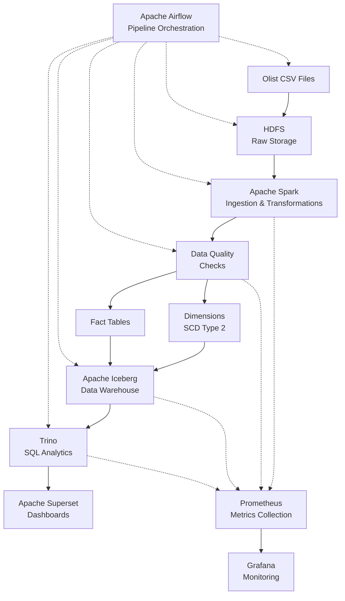
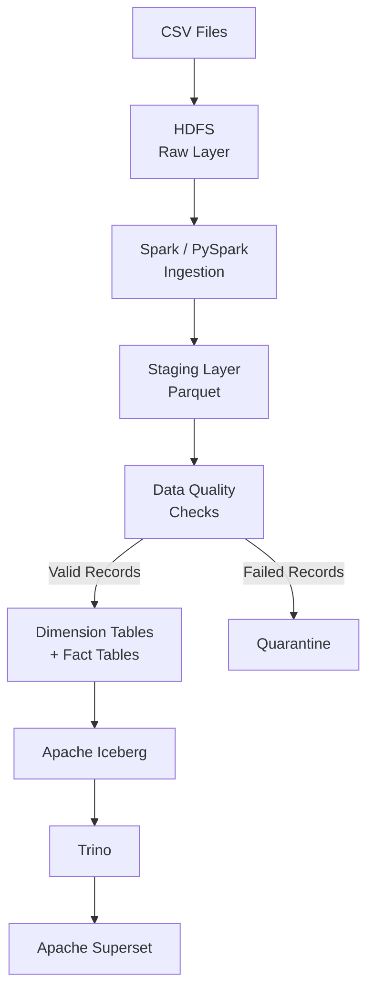

# Olist Ecommerce Data Pipeline

A **production-grade data engineering pipeline** for ingesting, validating, transforming, storing, and analyzing the **Olist Brazilian E-Commerce dataset**.

The platform processes **9 CSV datasets**, implements comprehensive data-quality checks, creates a dimensional data warehouse using **Apache Iceberg**, and provides SQL analytics through **Trino** with visualization through **Apache Superset**.

The entire process is automated using **Apache Airflow** and executed in a **CentOS environment** with Hadoop, Spark, Hive, Trino, Prometheus, and Grafana.

---

## Project Overview

The pipeline implements an **end-to-end modern data engineering architecture**.

Data flows through the following stages:

**Raw Data → HDFS → Spark/Staging → Data Quality Checks → Apache Iceberg Data Warehouse → Trino → Apache Superset**

Apache Airflow manages the complete workflow, including:

- Data ingestion
- Data transformation
- Data-quality validation
- Data warehouse loading
- Pipeline monitoring

The architecture provides a complete workflow from **raw data ingestion to analytical visualization**.

---

## Key Capabilities

- **Batch ingestion** of 9 Olist CSV datasets
- **Distributed data processing** using Apache Spark/PySpark
- **Data lake storage** using Hadoop HDFS
- **Parquet-based staging** for intermediate data
- **Automated data-quality validation** using predefined rules
- **Data-quality scoring and monitoring**
- **Failed-record quarantine** for invalid records
- **Star-schema data warehouse** architecture
- **Slowly Changing Dimension (SCD) Type 2** implementation
- **Apache Iceberg** analytical table storage
- **Hive Metastore integration**
- **SQL analytics** using Trino
- **Data visualization and dashboards** using Apache Superset
- **Pipeline monitoring** using Prometheus and Grafana
- **Airflow-based workflow orchestration**
- **Unit and integration testing**
- **Iceberg table optimization**
- **Hive Metastore backup and restore**

---

## Architecture



---

## Data Flow

This is the flow of the complete data pipeline:



---

## Dataset Inventory

The pipeline processes **9 Olist datasets**, containing approximately **126.19 MB of source data**.

| # | Dataset | File | Description |
|---:|---|---|---|
| 1 | **Customers** | `olist_customers_dataset.csv` | Customer information, including customer ID and unique customer ID. |
| 2 | **Geolocation** | `olist_geolocation_dataset.csv` | Mapping of ZIP codes to latitude and longitude coordinates. |
| 3 | **Orders** | `olist_orders_dataset.csv` | Order status, dates, timestamps, and customer relationships. |
| 4 | **Order Items** | `olist_order_items_dataset.csv` | Items included in orders, including product and pricing information. |
| 5 | **Order Payments** | `olist_order_payments_dataset.csv` | Payment methods and installment information associated with orders. |
| 6 | **Order Reviews** | `olist_order_reviews_dataset.csv` | Customer review scores and review comments. |
| 7 | **Products** | `olist_products_dataset.csv` | Product information and product category mapping. |
| 8 | **Sellers** | `olist_sellers_dataset.csv` | Seller information, including seller address and location details. |
| 9 | **Category Translation** | `product_category_name_translation.csv` | Translation of product categories from Portuguese to English. |

---

## Data Warehouse Model

The warehouse is designed using a **dimensional/star-schema architecture** with **Apache Iceberg**.

### Dimension Tables

| Table | Description |
|---|---|
| `dim_customers_iceberg` | Customer dimension containing customer information and historical tracking using **SCD Type 2**. |
| `dim_products_iceberg` | Product dimension containing product attributes and translated product categories. |
| `dim_sellers_iceberg` | Seller dimension containing seller data and performance-related metrics. |

### Fact Tables

| Table | Description |
|---|---|
| `fact_orders_iceberg` | Order-level transactional facts. Partitioned by date and contains analytical data relevant to orders. |
| `fact_order_items_iceberg` | Line-item-level transactional facts. |
| `fact_order_payments_iceberg` | Payment transaction facts containing payment-related information. |

---

## Data Quality Framework

The pipeline uses **automated data-quality validation** before loading data into the warehouse.

| Capability | Description |
|---|---|
| **Null Checks** | Identifies missing data in mandatory fields. |
| **Duplicate Detection** | Identifies duplicate records. |
| **Referential Integrity** | Validates foreign-key relationships among datasets. |
| **Category Mapping** | Verifies that product categories are mapped to valid translated categories. |
| **Range Validation** | Checks numeric ranges, prices, quantities, and dates. |
| **Outlier Detection** | Detects numeric outliers in tables. |
| **Format Validation** | Validates ID and ZIP-code patterns. |
| **DQ Scoring** | Computes daily data-quality scores for individual tables. |
| **Failed Record Quarantine** | Stores invalid records separately for review. |
| **DQ Alerting** | Notifies the team when data-quality thresholds are exceeded. |

---

## Data Quality Metrics

The following monitoring targets are associated with the pipeline:

| Metric | Target | Alert Threshold |
|---|---:|---|
| **DQ Score** | ≥ 95% | < 90% Warning / < 80% Critical |
| **Pipeline Duration** | < 100 minutes | > 120 minutes |
| **Data Freshness** | < 24 hours | > 30 hours |
| **Failed Records** | 0 | > 1,000 |

---

## Technology Stack

| Technology | Purpose |
|---|---|
| **Apache Airflow** | Workflow orchestration. |
| **Apache Spark / PySpark** | Distributed data ingestion and transformation. |
| **Hadoop HDFS** | Data lake and raw data storage. |
| **Apache Iceberg** | Analytical table and data warehouse storage. |
| **Apache Hive Metastore** | Metadata management for the data warehouse. |
| **PostgreSQL** | Database used for the Hive metastore. |
| **Trino** | SQL query engine for analytical data processing and analysis. |
| **Apache Superset** | Data visualization and dashboarding. |
| **Prometheus** | Metrics collection. |
| **Grafana** | Monitoring and metrics visualization. |
| **Python** | Data engineering and pipeline development. |
| **SQL** | Analytics and data warehouse queries. |

---

## Directory Structure

The project is organized into separate directories for **orchestration, data processing, storage, data quality, analytics, testing, documentation, and monitoring**.

```text
/home/hadoop-user/olist-ecommerce/
│
├── README.md                    # Project documentation
├── Makefile                     # Common command wrapper
├── .env.example                 # Environment variables template
│
├── airflow/                     # Apache Airflow DAGs and plugins
│   ├── dags/                    # DAG definitions (11 DAGs)
│   ├── plugins/                 # Custom operators and sensors
│   └── logs/                    # Airflow execution logs
│
├── spark/                       # PySpark jobs and resources
│   ├── jobs/                    # 25+ Spark jobs
│   ├── lib/                     # JAR dependencies
│   ├── scripts/                 # Spark submission scripts
│   └── notebooks/               # Jupyter notebooks
│
├── hadoop/
│   └── data/                    # HDFS data lake storage
│       ├── raw/                 # Raw CSV files (partitioned)
│       ├── staging/             # Staging data
│       ├── quality/             # Data-quality reports and metrics
│       └── warehouse/
│           └── iceberg/         # Apache Iceberg tables
│
├── hive/
│   └── scripts/                 # Hive DDL and migration scripts
│
├── postgresql/
│   └── init/                    # PostgreSQL metastore initialization
│
├── iceberg/
│   └── scripts/                 # Iceberg maintenance scripts
│
├── trino/
│   └── queries/                 # Trino SQL queries
│
├── superset/                    # Apache Superset dashboards
│
├── tests/                       # Unit and integration tests
│
├── docs/                        # Project documentation
│
├── scripts/                     # Utility and automation scripts
│
├── monitoring/                  # Prometheus and Grafana configuration
│
└── datasets/                    # Original Olist CSV datasets
```

### Directory Description

| Directory | Purpose |
|---|---|
| `airflow/` | Contains Airflow DAGs, custom plugins, and execution logs. |
| `spark/` | Contains PySpark ETL jobs, dependencies, submission scripts, and notebooks. |
| `hadoop/data/` | Contains the data lake layers, including raw, staging, quality, and Iceberg warehouse data. |
| `hive/` | Contains Hive DDL and migration scripts. |
| `postgresql/` | Contains PostgreSQL initialization files for the Hive Metastore. |
| `iceberg/` | Contains Apache Iceberg maintenance scripts. |
| `trino/` | Contains SQL queries used for analytical processing. |
| `superset/` | Contains Apache Superset dashboard resources. |
| `tests/` | Contains unit and integration tests. |
| `docs/` | Contains project documentation and runbooks. |
| `scripts/` | Contains utility and automation scripts. |
| `monitoring/` | Contains Prometheus and Grafana monitoring configuration. |
| `datasets/` | Contains the original Olist CSV datasets. |

---

## Quick Start

Navigate to the project directory:

```bash
cd /home/hadoop-user/olist-ecommerce
```

Copy and configure the environment variables:

```bash
cp .env.example .env
vim .env
```

Deploy the pipeline:

```bash
make deploy
```

Run data-quality checks:

```bash
make dq-check
```

Start Airflow:

```bash
make airflow-start
```

Trigger the main ETL DAG:

```bash
make dag-trigger
```

Run an analytical query:

```bash
make run-query QUERY=customer_360/customer_summary.sql
```

Monitor the pipeline:

```bash
make monitor
```

---

## Makefile Commands

| Command | Description |
|---|---|
| `make help` | Show all available commands. |
| `make deploy` | Deploy the entire pipeline. |
| `make dq-check` | Run data-quality checks. |
| `make airflow-start` | Start Airflow services. |
| `make airflow-stop` | Stop Airflow services. |
| `make airflow-status` | Check Airflow service status. |
| `make dag-trigger` | Trigger the main ETL DAG. |
| `make dag-unpause` | Unpause the main ETL DAG. |
| `make dag-pause` | Pause the main ETL DAG. |
| `make run-query QUERY=path/to/query.sql` | Run a Trino SQL query. |
| `make run-dq` | Run daily data-quality monitoring. |
| `make optimize` | Optimize Iceberg tables. |
| `make backup` | Back up the Hive Metastore. |
| `make restore` | Restore the Hive Metastore. |
| `make monitor` | Show pipeline status. |
| `make clean` | Clean temporary files. |
| `make test` | Run unit and integration tests. |

---

## Monitoring & Alerting

The pipeline uses **Prometheus** and **Grafana** to monitor pipeline performance, data quality, and operational health.

| Component | Purpose | Port |
|---|---|---:|
| **Prometheus** | Metrics collection | `9090` |
| **Grafana** | Metrics visualization and monitoring dashboards | `3000` |

### Alerts

The monitoring framework provides alerts for:

- **Data-quality threshold breaches**
- **Pipeline failures**
- **Data staleness**

---

## Troubleshooting

### Common Issues

#### 1. Airflow DAG Not Showing

Check the Airflow service status:

```bash
make airflow-status
```

Inspect the Airflow scheduler logs:

```bash
tail -f $AIRFLOW_HOME/logs/scheduler/latest/*.log
```

#### 2. Iceberg Table Not Found

Check the available tables in the Olist warehouse:

```bash
hive -e "SHOW TABLES IN olist_warehouse"
```

#### 3. Metastore Connection Failed

Test the PostgreSQL Hive Metastore connection:

```bash
psql -h localhost -U hive -d metastore -c "SELECT 1"
```

#### 4. Data Quality Checks Failing

Inspect the generated data-quality reports:

```bash
cat /opt/hadoop/data/quality/dq_reports/*.json
```

---

## Support

Additional project resources are available in the following directories:

| Resource | Location |
|---|---|
| **Documentation** | `/home/hadoop-user/olist-ecommerce/docs/` |
| **Runbooks** | `/home/hadoop-user/olist-ecommerce/docs/runbooks/` |
| **Airflow Logs** | `/opt/airflow/logs/` |
| **Hadoop Logs** | `/opt/hadoop/logs/` |

---

## License

This project is intended for **educational and internal use only**.

---

## Contributors

**Ayankoya Olayiwola**

---

## Version

**Current Version:** `1.0.0`

**Last Updated:** `05-01-2026`
