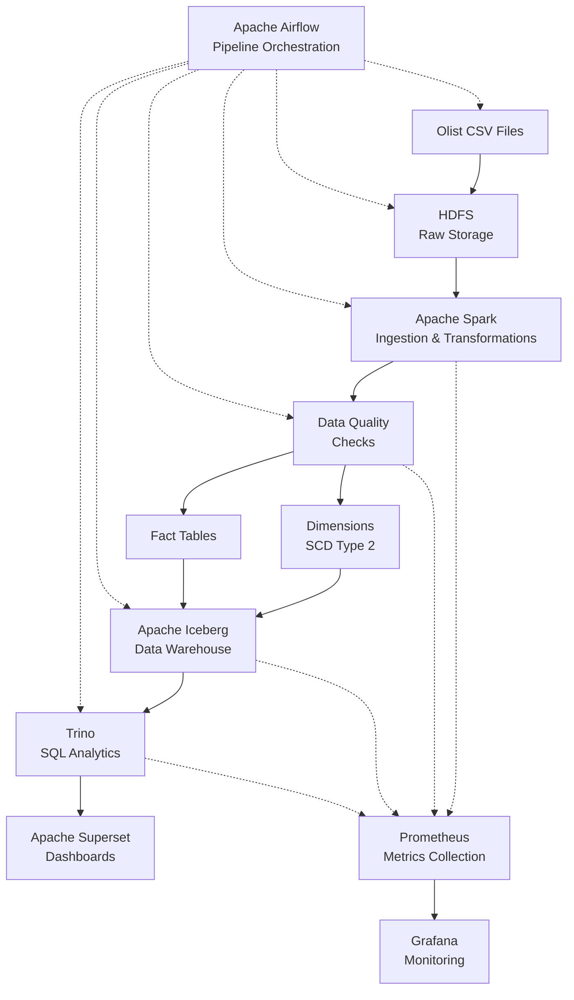
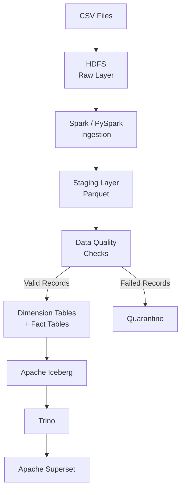

# olist-ecommerce

Olist Ecommerce Data Pipeline
A production grade data engineering pipeline for ingesting, validating, transforming, storing and analysing the Olist Brazilian E-Commerce dataset. The platform processes 9 CSV datasets (38.19 MB in total), implements extensive data quality checks, creates a dimensional data warehouse via Apache Iceberg, and offers SQL analytics via Trino and visualization via Apache Superset. All the process is automated with Apache Airflow and executed in a CentOS environment with Hadoop, Spark, Hive, Trino, Prometheus, and Grafana.

Project Overview
The pipeline implements an end-to-end modern data engineering architecture:
The data is fed into the pipeline from Raw Data into HDFS and then moved to the Spark/Staging layer where it undergoes data quality checks before being loaded into the Iceberg Data Warehouse and finally into the Trino layer for use in the Superset web app.
Apache Airflow manages the ingestion, transformation, data quality, warehouse load and monitoring processes.

Key Capabilities
It is possible to ingest 9 Olist CSV datasets in a batch.
Distributed processing using Apache Spark/PySpark
Storage that uses HDFS.Data lake storage using HDFS.
Parquet-based staging
Automated data quality validation: Automatically check data quality against pre-defined rules.
Data quality scoring and monitoring.
Failed-record quarantine
Star-schema data warehouse
Slowly Changing Dimension (SCD) Type 2 dimensions
This is an Apache Iceberg table storage.
Hive metastore integration
Use SQL to analyze data via Trino.
Visualization and dashboard with Superset
Monitor Pipeline with Prometheus and Grafana
Airflow-based workflow orchestration
Testing techniques: Unit and integration testing.
The optimization of Iceberg tables and backup/restore of metastore.

## Architecture

Dataset Inventory
The pipeline works on 9 data sets, with some 126.19 MB of source data.
                          Dataset File                                            Description
1. Customers      olist_customers_dataset.csv            Customer information, such as customer unique ID or customer ID
2. Geolocation    olist_geolocation_dataset.csv          Zip-code-to-latitude/longitude mapping
3. Orders         olist_orders_dataset.csv               Assess order status, dates, and customer relationships.Review order status, dates, and customer connections.
4. Order Items    olist_order_items_dataset.csv          Items added to orders, and linked to the price quote.
5. Order Payments olist_order_payments_dataset.csv       The payment system and installments details.How one pays and installment information.
6. Order Reviews  olist_order_reviews_dataset.csv        Customer comment and scores on review!
7. Products       olist_products_dataset.csv             For the last two, the product names and category mapping are important.
8. Sellers        olist_sellers_dataset.csv              The address and seller details are provided.Address and seller information are given.
9. Category Translation   product_category_name_translation.csv         Translation of product categories from Portuguese to English.

## Data Flow

This is the flow of the complete data pipeline:

## Data Warehouse Model

The warehouse is designed using a **dimensional/star-schema architecture** with **Apache Iceberg**.

### Dimension Tables

| Table | Description |
|---|---|
| `dim_customers_iceberg` | Customer dimension containing customer information and historical tracking using **SCD Type 2**. |
| `dim_products_iceberg` | Product dimension containing product attributes and translated product categories. |
| `dim_sellers_iceberg` | Seller dimension containing seller data and performance-related metrics. |

### Fact Tables

| Table | Description |
|---|---|
| `fact_orders_iceberg` | Order-level transactional facts. Partitioned by date and contains analytical data relevant to orders. |
| `fact_order_items_iceberg` | Line-item-level transactional facts. |
| `fact_order_payments_iceberg` | Payment transaction facts containing payment-related information. |

---

## Data Quality Framework

The pipeline uses **automated data-quality validation** before loading data into the warehouse.

| Capability | Description |
|---|---|
| **Null Checks** | Identifies missing data in mandatory fields. |
| **Duplicate Detection** | Identifies duplicate records. |
| **Referential Integrity** | Validates foreign-key relationships among datasets. |
| **Category Mapping** | Verifies that product categories are mapped to valid translated categories. |
| **Range Validation** | Checks numeric ranges, prices, quantities, and dates. |
| **Outlier Detection** | Detects numeric outliers in tables. |
| **Format Validation** | Validates ID and ZIP-code patterns. |
| **DQ Scoring** | Computes daily data-quality scores for individual tables. |
| **Failed Record Quarantine** | Stores invalid records separately for review. |
| **DQ Alerting** | Notifies the team when data-quality thresholds are exceeded. |

---

## Data Quality Metrics

The following monitoring targets are associated with the pipeline:

| Metric | Target | Alert Threshold |
|---|---:|---|
| **DQ Score** | ≥ 95% | < 90% Warning / < 80% Critical |
| **Pipeline Duration** | < 100 minutes | > 120 minutes |
| **Data Freshness** | < 24 hours | > 30 hours |
| **Failed Records** | 0 | > 1,000 |

---

## Technology Stack

| Technology | Purpose |
|---|---|
| **Apache Airflow** | Workflow orchestration. |
| **Apache Spark / PySpark** | Distributed data ingestion and transformation. |
| **Hadoop HDFS** | Data lake and raw data storage. |
| **Apache Iceberg** | Analytical table and data warehouse storage. |
| **Apache Hive Metastore** | Metadata management for the data warehouse. |
| **PostgreSQL** | Database used for the Hive metastore. |
| **Trino** | SQL query engine for analytical data processing and analysis. |
| **Apache Superset** | Data visualization and dashboarding. |
| **Prometheus** | Metrics collection. |
| **Grafana** | Monitoring and metrics visualization. |
| **Python** | Data engineering and pipeline development. |
| **SQL** | Analytics and data warehouse queries. |
